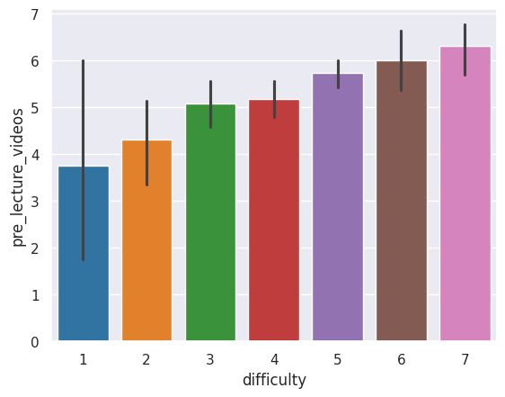
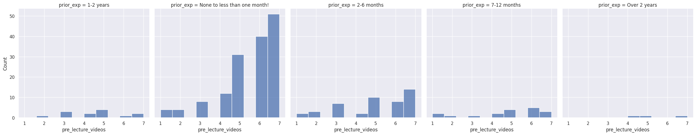
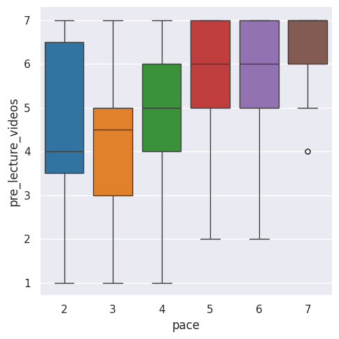

---
# Do not edit the text between these lines!
layout: default
---

# Should there be Pre-Lecture Videos: Yay or Nay?

<!-- This is a comment. Below, you'll see code for inserting an image. To make this image appear, update <custom-path>. To add an image, save it inside the imgs folder of this repository. -->

## Summary
### Visualization 1: Difficulty and a Preference for Pre-Lecture Videos.
The data that we analyzed was the based on the idea of the course including pre-lecture videos as a way to make the content in the class easier to understand based on comparing the data collected from the pre_lecture_videos column, prior_exp column, difficulty column, and pace column.  

In the first visualization which compared the difficulty of the class and expressed desire for pre lecture videos the data indicated that those who found the class more difficult and rated it at 7 on a scale from 1-7 also would prefer having pre lecture videos. The histogram supports the idea that pre lecture videos would make the content of the class easier to understand. Further, the histogram demonstrates a positive upward trend indicating a strong correlation between the two categories. The standard error bar on the difficulties above 4 suggest that there is a lower variability amongst those values.

### Visualization 2: Prior experience and Preference for Pre-Lecture Videos
In the second visualization prior experience is compared to the desire for pre lecture videos. There is a set of 5 barplots each of represents a different category of prior experience: None - less than a month, 2-6 months, 7-12 months, over 1 year, and 2-6 years. The ranking for preference for pre lecture videos is broken up amongst the distinct categories to distinguish how the general trend of pre lecture videos differs amongst the categories. The category of those who have "None - less than a month" express the greatest preference for pre leture videos. While the other categories do not express as high of ranking for pre lecture videos they still do express it slight. This suggests that pre lecture videos are beneficial to all students to make understanding the content easier, although they are more preferred by those with less experience.

### Visualization 3: Pace and Preference for Pre-Lecture Videos

In the third visualization the pace of the class in compared to the preference for pre lecture videos. The boxplot suggested that those who ranked the pace to be between a 5-7, a fast paced class, would more prefer that there are pre lecture videos as opposed to those who ranked it between a 2-4. However, those who ranked the pace of the class a 2 have a greater variability amongst how much they would prefer pre lecture videos with the median around a 4. Those who ranked the pace a 3 or 4 have medians of around 4.5 and 5, respectively, which is close to that of thoe who ranked the pace of the class a 2. The boxplot overall suggested a large number of students would prefer to have pre lecture videos which supports the idea that pre lecture videos would make content easier to understand.

## Conclusions and Future Directions

The analysis done based on the visualizations indictates that the idea that the course should include pre lecture videos to make content easier to understand is clearly supported. However, this idea can be further refined with more targeted data collection. To gain further insight into the preference for pre lecture videos another survey can be conducted in which students can express what they would want to be included in pre lecture videos, how long they woulod want to videos to be, how much they would use the videos, etc. These are a few questions that could yield data to support the benefits of pre lecture videos for students. Conversely, while there are benefits to pre lecture videos there are also potential downsides as well. Students who watch pre lecture videos may prefer not to come to class as there are videos to watch instead. Another potential downside is any questions students may have may be harder to address as it is easy to forget a question that you had while watching the video, which could leave questions unanswered if they are not aske in class. Despite this, there is a great benefit to pre lecture videos as it primes students on class content. Overall, the current data and potentially future data supports the use of pre lecture videos.